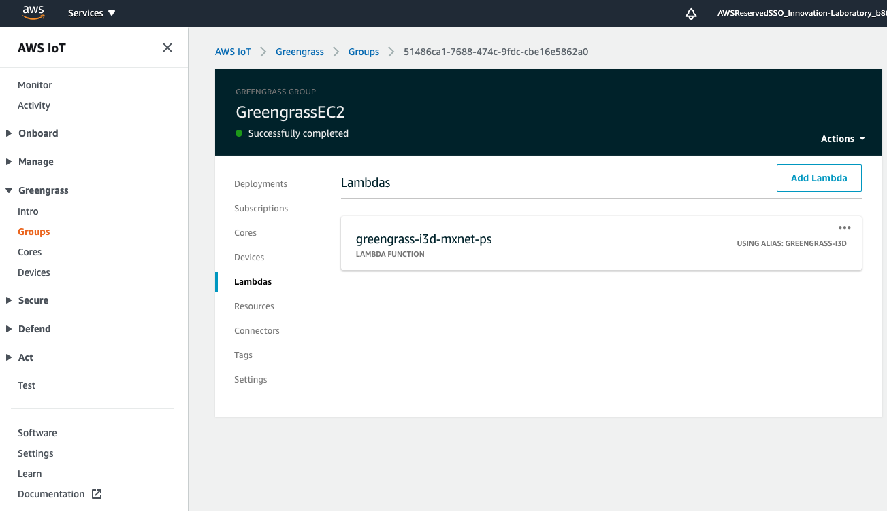
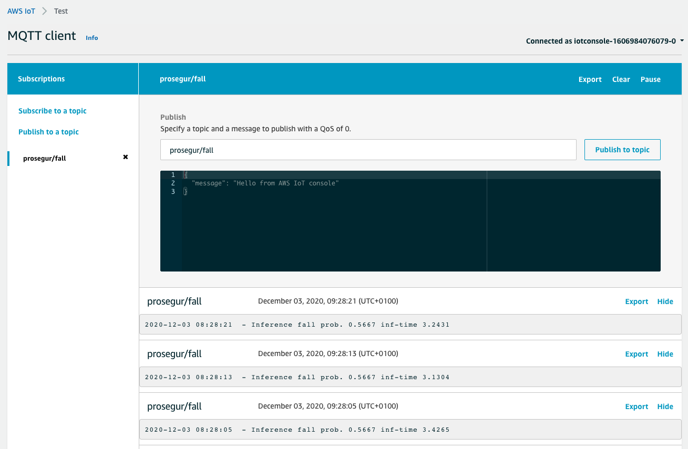

## **Activity Detection at the Edge**

This is an example on how to apply Machine Learning with Computer Vision models in AWS for detection activities from live video streams at the edge. In this use case, we are looking to detect when a person falls to the floor from their home security cameras' streams, in order to trigger an alarm or event for sending help to their home.

For reproducing this experiment you will:
* Setup an edge device compatible with AWS IoT Greengrass, such as a Raspberry Pi, Jetson Nano, AWS DeepLens, Amazon Panorama, etc. You can check the compatibility in the [documentation](https://docs.aws.amazon.com/greengrass/latest/developerguide/what-is-gg.html#gg-platforms).

and either:

* Copy one of the included models in this repo to your edge device for detecting people falling, deploying its corresponding inference scripts as AWS Lambda functions via AWS IoT Core

or

* Adapt the notebook included in this repo for applying the transfer learning for your specific use case of activity to detect
* Copy your newly trained model to your edge device for detecting your custom activity, deploying its corresponding inference scripts as AWS Lambda functions via AWS IoT Core

### **Case #1: Detecting people falling from a pre-trained I3D model:**

The first model included in this repo is based on the ["Activity detection on a live video stream with Amazon SageMaker"](https://aws.amazon.com/blogs/machine-learning/activity-detection-on-a-live-video-stream-with-amazon-sagemaker/) blog post from the AWS Machine Learning Blog, where the code has been adapted for the detection of people falling to the ground with a custom dataset from public videos, and applying transfer learning from the pre-trained model of the [MXNet Gluon Zoo "i3d_resnet50_v1_hmdb51"](https://cv.gluon.ai/model_zoo/action_recognition.html#hmdb51-dataset)

After running the notebook and scripts included in the "Build" folder of this repo on an Amazon SageMaker Notebook instance, you should get as an output a model artifact as "model.tar.gz" stored on Amazon S3. In this case this artifact contains the "model-symbol.json" and "model-0000.params" files included in the "Deploy" folder of this repo.

#### **Deploying the model to the Edge device:**

* Follow the [AWS IoT Greengrass Getting Started documentation](https://docs.aws.amazon.com/greengrass/latest/developerguide/gg-gs.html) for setting up your edge device on the AWS IoT Core console.

* Install the pre-requisites such as MXNet, Gluon, etc. as suggested on the [pre-requisites.txt](./deploy/pre-requisites.txt) file. Make sure you follow specific steps for your device e.g. MXNet official documentation for installing on Raspberry Pi, etc.

* Copy both model files (extracting your model.tar.gz, or directly taking the json and params files included in this repo) to your edge device via SCP. Place those in a folder and bear in mind the users and permissions to the folder

* When creating the AWS Lambda function, create two functions based on the scripts included in the "Build" folder of this repo:
    * video-ps: Script for capturing the camera of the device and creating small videos for passing to the inference function - Note: For debugging purposes you can also skip this function and manually copying to your device the sample video included in this repo
    * greengrass-i3d-mxnet-ps: Function for loading the MXNet Gluon model and running the inferences on local videos at the device. Note you must adapt the model_path to the folder where you copied your model files

* Deploy the AWS IoT Group to your edge device Core

* Subscribe to the MQTT topic to verify that your instance is sending the messages with the probability of having a person falling to the floor within the last seconds

#### **To be done - Work in progress:**

* Creating the AWS CloudFormation template for automatically deploying this solution
* Adapt the functions for also sending a copy of the videos to Amazon S3 when a high probability of fall is detected

